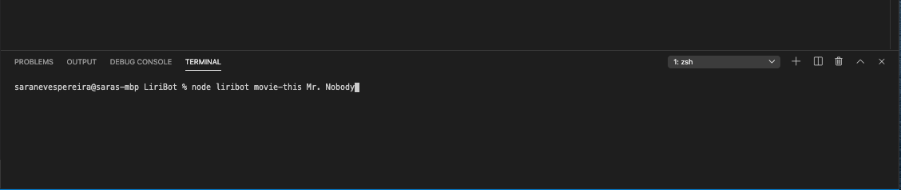
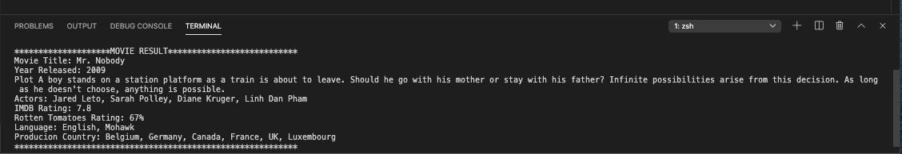
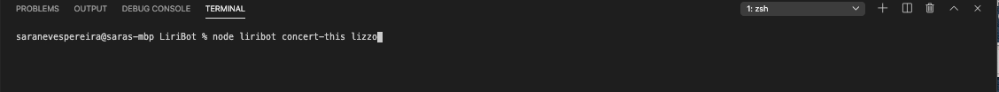
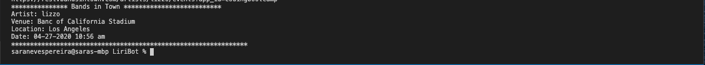
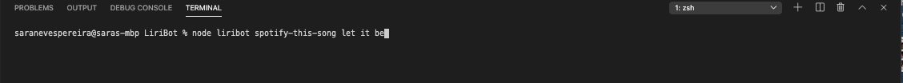

# LiriBot

### A CLI app that searches three different APIs and retrieves specific information to the User.  

## The first command will search the OMDB API. Here is the command the user will have to input:

## Using axios, the command will retrieve the information to deliever it to the user: 

## The same will happen with the Bands in Town API using the concert-this command as seen below:

## Liri Bot also uses the Spotify API. However, Sportify has it's own retrieval information through node. The "node-spotify-api" npm package was
## used to allow song information retrieval as seen below:

## The fourth command, do-what-it-says, will have node read from a file and executing the search written in it: 

